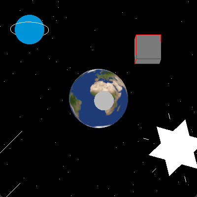

# OpenGL Space Scene

This is a simple example of a space scene using OpenGL using the [`glium`](https://github.com/glium/glium),
a OpenGL Rust Library.

## Authors:

- Dennis Lemke Green - 11219108
- Eduardo Figueiredo Freire Andrade - 11232820
- Fábio Dias Cunha - 11320874
- Rafael Tavares Oliveira - 11219071